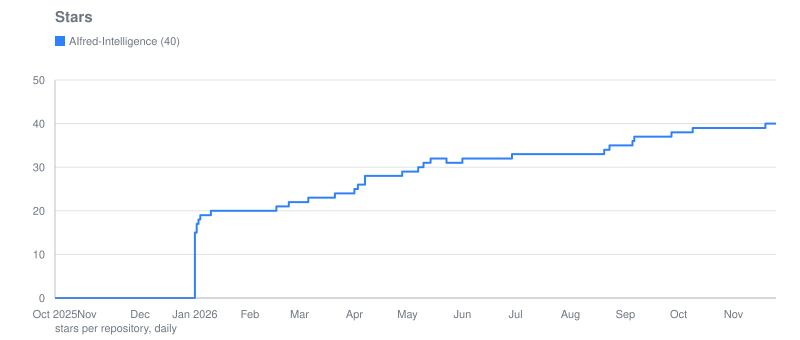
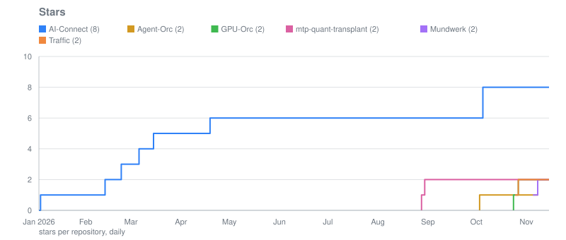
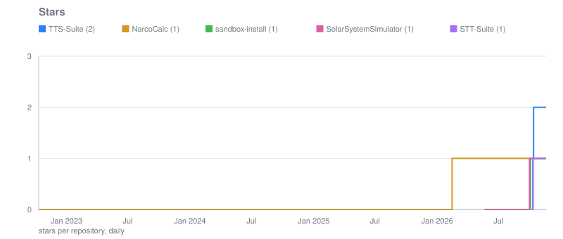
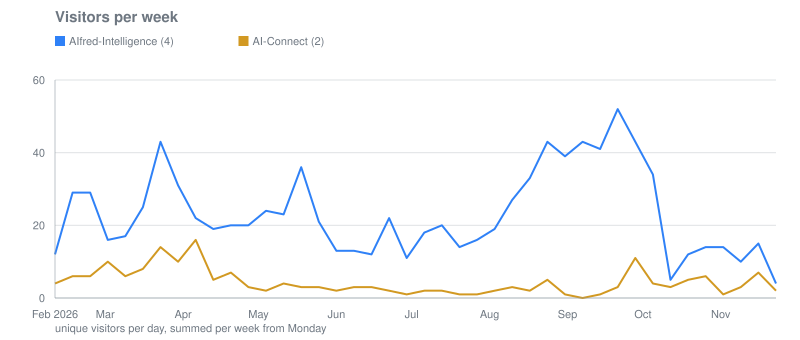
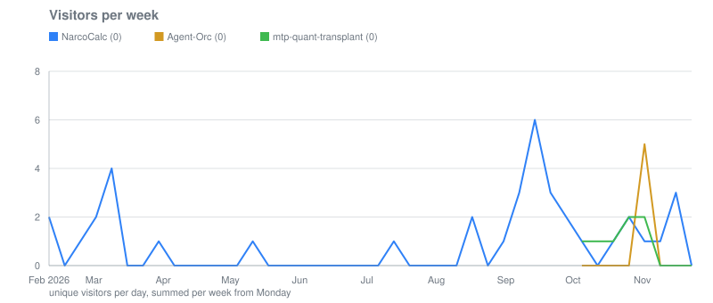
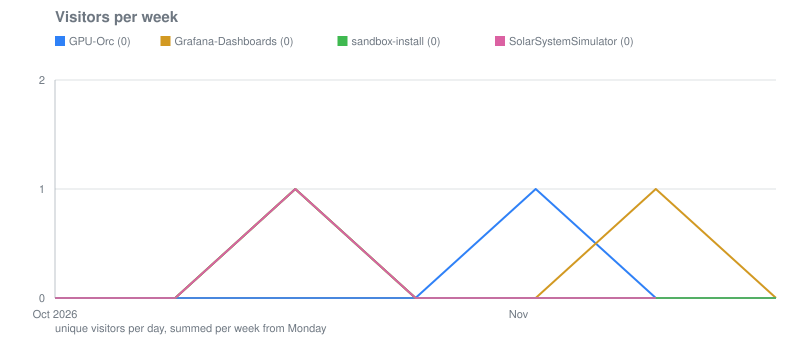
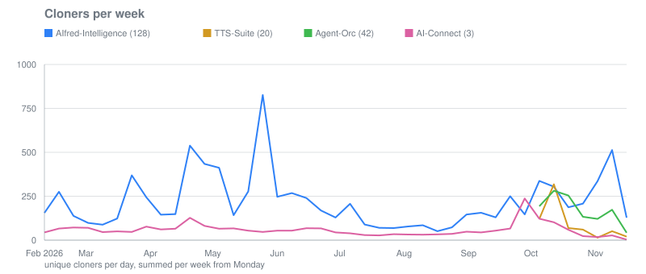
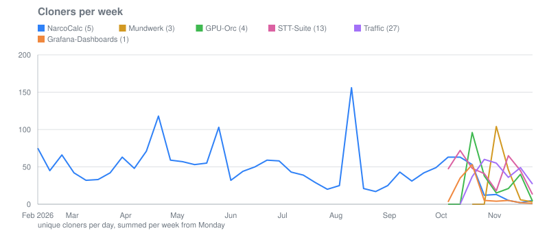
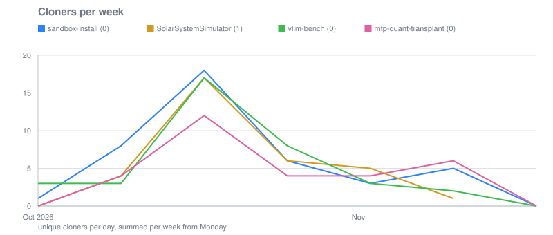

# Traffic

Daily GitHub statistics of the public repositories of [Peuqui](https://github.com/Peuqui), collected by
[a workflow](.github/workflows/traffic.yml) at 01:00 UTC. GitHub keeps views and clones for 14 days
only; the daily snapshots in [data/](data/) turn them into a history. GitHub reports counts, never who:
no names, no addresses. Repositories of a similar size share a chart; the groups follow the numbers.

## Stars

## Visitors per week

## Cloners per week

## All repositories

| Repository | Stars | Forks | Visitors 14 d | Cloners 14 d | Automated, at least | Views since | Clones since | Release downloads |
|---|---:|---:|---:|---:|---:|---:|---:|---:|
| [Agent-Orc](data/Agent-Orc/README.md) | 2 | 0 | 5 | 318 | 98 % | 8 (11.10.2026) | 2796 (11.10.2026) | 0 |
| [AI-Connect](data/AI-Connect/README.md) | 8 | 4 | 6 | 45 | 91 % | 234 (09.02.2026) | 4319 (09.02.2026) | 16 |
| [AIfred-Intelligence](data/AIfred-Intelligence/README.md) | 39 | 3 | 25 | 875 | 97 % | 1544 (09.02.2026) | 39434 (09.02.2026) | 0 |
| [GPU-Orc](data/GPU-Orc/README.md) | 2 | 0 | 1 | 46 | 98 % | 1 (11.10.2026) | 330 (11.10.2026) | 0 |
| [Grafana-Dashboards](data/Grafana-Dashboards/README.md) | 0 | 0 | 1 | 8 | 88 % | 3 (11.10.2026) | 182 (11.10.2026) | 0 |
| [mtp-quant-transplant](data/mtp-quant-transplant/README.md) | 2 | 0 | 1 | 9 | 100 % | 8 (11.10.2026) | 38 (11.10.2026) | 0 |
| [Mundwerk](data/Mundwerk/README.md) | 2 | 0 | 0 | 154 | 100 % | 0 (23.10.2026) | 334 (23.10.2026) | 0 |
| [NarcoCalc](data/NarcoCalc/README.md) | 1 | 0 | 2 | 14 | 93 % | 66 (09.02.2026) | 3257 (09.02.2026) | 0 |
| [sandbox-install](data/sandbox-install/README.md) | 1 | 0 | 0 | 8 | 100 % | 1 (11.10.2026) | 53 (11.10.2026) | 0 |
| [SolarSystemSimulator](data/SolarSystemSimulator/README.md) | 1 | 0 | 0 | 7 | 100 % | 1 (11.10.2026) | 71 (11.10.2026) | 0 |
| [STT-Suite](data/STT-Suite/README.md) | 1 | 0 | 0 | 88 | 100 % | 0 (11.10.2026) | 562 (11.10.2026) | 0 |
| [Traffic](data/Traffic/README.md) | 2 | 0 | 0 | 80 | 100 % | 0 (12.10.2026) | 377 (12.10.2026) | 0 |
| [TTS-Suite](data/TTS-Suite/README.md) | 2 | 0 | 0 | 95 | 100 % | 0 (11.10.2026) | 1288 (11.10.2026) | 0 |
| [vllm-bench](data/vllm-bench/README.md) | 0 | 0 | 0 | 5 | 100 % | 0 (10.10.2026) | 53 (10.10.2026) | 0 |

- **Visitors, cloners 14 d:** unique per day, summed over the last 14 days (one person on two days
  counts twice; GitHub's own 14-day uniques are in each snapshot).
- **Automated, at least:** the share of those cloners that cannot have been visitors of the page that
  day. People nearly always look at the page before they clone; mirrors, archives, scanners and
  crawlers do not. A lower bound, not a count: a bot may open the page too.
- **since:** every day counted once, from the first snapshot (date in brackets).
- **Release downloads:** GitHub's running total per release file, summed.

Each repository's folder holds its page with charts and referrers, `traffic.jsonl` (one snapshot per
day), `stars-daily.json` (stars per day, without names) and the charts.
